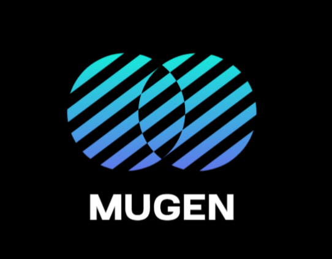

<p align="center">
  
</p>

<h1 align="center">MUGEN (無限) — Infinite Discipline</h1>

<p align="center">
  <strong>Gamified Monthly Habit Tracker &amp; High-Density Analytics Dashboard</strong>
  <br />
  <em>Track habits, maintain streaks, level up your life, and achieve infinite discipline.</em>
</p>

<p align="center">
  
  
  
  
  
  
  
</p>

---

## 📥 Downloads

| Platform | Download | Format | Description |
| :--- | :--- | :--- | :--- |
| 🪟 **Windows Desktop** | [Download Installer](https://github.com/varunkmr1811-cyber/MUGEN-/releases) | `.exe` (NSIS) | One-click setup with desktop shortcut & start menu |
| 🪟 **Windows Portable** | [Download Portable](https://github.com/varunkmr1811-cyber/MUGEN-/releases) | `.exe` | Direct runnable without installation |
| 🌐 **Web Dashboard** | Run locally with `npm run dev` | Web App | Zero-install in any modern browser |
| 📱 **Android** | Build with Android Studio | `.apk` | Native Android app powered by Capacitor |

---

## ✨ Features

- **📊 High-Density Dark Dashboard** — Sleek obsidian dark theme with sky blue & emerald accents
- **📅 Monthly Habit Matrix** — Track unlimited habits across every day of the month
- **✅/❌ 3-State Toggle** — Check (✓), Cancel (✕), or Clear for each habit cell
- **📈 Real-Time Analytics** — Daily progress bars, weekly averages, KPI badges, and donut chart
- **🎮 Gamification** — XP system, level progression, streak tracking, and achievements
- **🎆 Celebrations** — Confetti explosions and sound effects for milestones
- **😴 Wellness Tracking** — Sleep hours, mood ratings (😢→😊), and daily reflection notes
- **💾 Data Persistence** — LocalStorage with JSON export/import for backups
- **🔊 Synthesized Audio** — Web Audio API sound effects (toggleable)
- **📱 Cross-Platform** — Web, Windows, and Android

---

## 🚀 Quick Start

### Prerequisites
- **Node.js** ≥ 20.x
- **npm** ≥ 10.x

### Install Dependencies
```bash
npm install
```

### Development (Web)
```bash
npm run dev
```
Open [http://localhost:5173](http://localhost:5173)

### Build (Web)
```bash
npm run build
```

---

## 🖥️ Windows Desktop App (Electron)

### Run in Development Mode
```bash
npm run electron:dev
```

### Build Windows Installer (.exe)
```bash
npm run electron:build
```
Output: `release/MUGEN-Setup-1.0.0.exe`

### Build Portable Version
```bash
npm run electron:build-portable
```
Output: `release/MUGEN-Portable-1.0.0.exe`

> **Note**: If you encounter EPERM errors during build, ensure no Vite dev server is running and temporarily disable Windows Defender's Controlled Folder Access.

---

## 📱 Android App (Capacitor)

### Prerequisites
- **Android Studio** installed
- **Android SDK** ≥ API 22
- **Java JDK** ≥ 17

### Initial Setup
```bash
# Initialize Android platform (only needed once)
npm run cap:init-android

# Generate app icons for Android
node scripts/generate-icons.mjs
```

### Sync Web App to Android
```bash
npm run cap:sync
```

### Open in Android Studio
```bash
npm run cap:open-android
```

### Run on Device/Emulator
```bash
npm run cap:run-android
```

### Build APK
1. Run `npm run cap:build-android`
2. Open Android Studio
3. Go to **Build → Build Bundle(s) / APK(s) → Build APK(s)**
4. APK will be at `android/app/build/outputs/apk/debug/app-debug.apk`

---

## 📁 Project Structure

```
MUGEN/
├── android/              # Capacitor Android project (auto-generated)
├── build-resources/      # Icons for Electron build
│   ├── icon.ico          # Windows app icon
│   ├── icon.png          # PNG icon (256x256)
│   └── icon.svg          # Source SVG icon
├── dist/                 # Built web app
├── electron/             # Electron main process
│   ├── main.cjs          # Main process entry
│   └── preload.cjs       # Preload script
├── public/               # Static assets
├── scripts/              # Build scripts
│   └── generate-icons.mjs
├── src/
│   ├── components/       # React components
│   │   ├── AchievementsModal.tsx
│   │   ├── AddHabitModal.tsx
│   │   ├── DayDetailsModal.tsx
│   │   ├── HabitMatrix.tsx
│   │   ├── Header.tsx
│   │   ├── MonthNavigation.tsx
│   │   ├── StatsRow.tsx
│   │   └── WellnessSection.tsx
│   ├── types/            # TypeScript type definitions
│   │   └── habit.ts
│   ├── utils/            # Utility modules
│   │   ├── audio.ts      # Web Audio API sounds
│   │   ├── dateUtils.ts  # Calendar math
│   │   ├── mockData.ts   # Demo data generator
│   │   ├── statsUtils.ts # Analytics computation
│   │   └── storage.ts    # LocalStorage persistence
│   ├── App.tsx           # Root component
│   ├── App.css           # App-specific styles
│   ├── index.css         # Global styles + Tailwind
│   └── main.tsx          # React entry point
├── capacitor.config.ts   # Capacitor config
├── package.json          # Dependencies & scripts
└── vite.config.ts        # Vite + Tailwind config
```

---

## 🛠️ Available Scripts

| Script | Description |
|--------|-------------|
| `npm run dev` | Start Vite dev server |
| `npm run build` | Build web app for production |
| `npm run preview` | Preview production build |
| `npm run electron:dev` | Build + launch Electron app |
| `npm run electron:build` | Build Windows NSIS installer |
| `npm run electron:build-portable` | Build portable Windows .exe |
| `npm run cap:sync` | Build + sync to Capacitor Android |
| `npm run cap:open-android` | Open Android project in Android Studio |
| `npm run cap:run-android` | Run on Android device/emulator |

---

## 🎨 Tech Stack

- **Frontend**: React 19, TypeScript 6
- **Styling**: Tailwind CSS 4 (Vite plugin)
- **Build**: Vite 8
- **Desktop**: Electron 44
- **Mobile**: Capacitor 8
- **Icons**: Lucide React
- **Effects**: Canvas Confetti
- **Audio**: Web Audio API (built-in, no external files)

---

## 📄 License

MIT License — Free to use, modify, and distribute.
